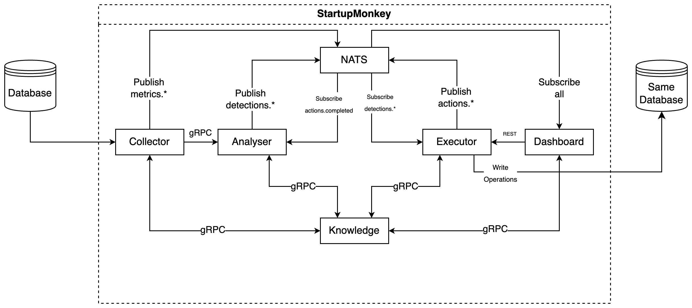

# StartupMonkey

Autonomous database performance optimisation system for early-stage startups and solo developers.


## The Problem

You've built an application using AI without any trained knowledge of software systems or database systems. It works. Users arrive. Traffic grows. Then your database starts struggling, queries slow down, connections pile up, and you're staring at logs with no idea what's wrong.

Hiring a DBA is expensive. Learning database internals takes months. Your users are experiencing slow load times right now.

## The Solution

StartupMonkey monitors your database, detects performance issues, and fixes them automatically. No complex configuration. Connect your database and it starts working.

**What it detects:** missing indexes, table bloat, long-running queries, idle transactions, connection pool exhaustion, poor cache hit rates, high latency.

**What it does:** creates indexes (non-blocking), runs VACUUM, terminates problematic queries, tunes configuration, deploys Redis cache layer. Actions can be rolled back either through automated verification/performance degredation or manual user intervention where applicable.

## Quick Start

```bash
git clone https://github.com/EricMurray-e-m-dev/StartupMonkey.git
cd StartupMonkey
docker-compose up --build
```

Open [http://localhost:3000](http://localhost:3000) and add your database connection string.

## Supported Databases

- **PostgreSQL** — Full support (metrics, indexes, vacuum, config tuning, query termination)
- **MySQL** — Metrics collection, index creation, query termination
- **MongoDB** — Metrics collection, index creation

## Architecture

StartupMonkey implements the MAPE-K feedback loop as five microservices:



- **Collector** — Gathers metrics from your database every 10 seconds
- **Analyser** — Rules-based detection engine identifies performance issues
- **Executor** — Applies optimisations with rollback capability
- **Knowledge** — Stores configuration and coordinates services (Redis-backed)
- **Dashboard** — Real-time visibility and manual controls (Next.js)

Communication uses gRPC for synchronous requests and NATS for async events.

## Execution Modes

- **Autonomous** — Detects and fixes issues automatically
- **Approval** — Queues actions for your approval before executing
- **Observe** — Reports issues only, takes no action

## Configuration

Thresholds can be adjusted in the Dashboard Settings page:

- Sequential scan threshold and delta
- Connection pool usage alert
- Cache hit rate minimum
- P95 latency threshold
- Dead tuple ratio for bloat detection
- Long-running query timeout

## Project Structure

```
StartupMonkey/
├── collector/        # Metrics collection (Go)
├── analyser/         # Detection engine (Go)
├── executor/         # Action execution (Go)
├── knowledge/        # State management (Go + Redis)
├── dashboard/        # Web UI (Next.js)
├── proto/            # gRPC definitions
└── tests/evaluation/ # Test containers per detector
```

## Development

```bash
# Run services locally
cd collector && go run cmd/collector/main.go
cd analyser && go run cmd/analyser/main.go
cd executor && go run cmd/executor/main.go
cd knowledge && go run cmd/knowledge/main.go
cd dashboard && npm run dev:all

# Run tests
go test ./... -v
```

## Documentation

See the [Wiki](https://github.com/EricMurray-e-m-dev/StartupMonkey/wiki) for detailed documentation.

## Limitations

- Some PostgreSQL features require the `pg_stat_statements` extension
- Query termination requires superuser or `pg_signal_backend` role
- MySQL and MongoDB have limited action coverage compared to PostgreSQL currently.

## License

MIT